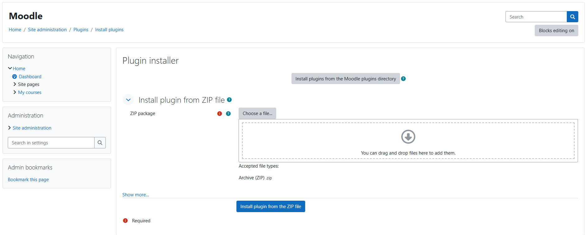
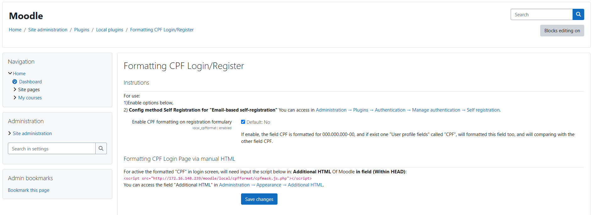

# cpfformat
local_cpfformat is plugin of moodle - Dev: Lyelfiz - LHCV
=======================================

IMPORTANT NOTE: This plugin is under development. Use at your own risk!

# What is that plugin

This plugin is CPF formatting and validation for creation/login of accounts in Moodle,
if enable this plugin will formatting CPF in format 00000000000 for 000.000.000-00,
and will mandatory put CPF in creation of account.

# Plugin requirement

<strong>Moodle version:</strong> 4.4.9+
 Need in Moodle <strong>"Self registratin"</strong> active in <strong>"Email-based self-registration"</strong>

# Intall Plugin
For install this plugin, you need download this plugin in .zip and put in
 <strong>"Administration -> Plugins -> Install plugins"</strong> 
after that put plugin.zip in Install plugin from ZIP file, example below in the image...

# Enable Plugin
After install, you need enable de plugin, for that you can enable following the instruction in image below...

