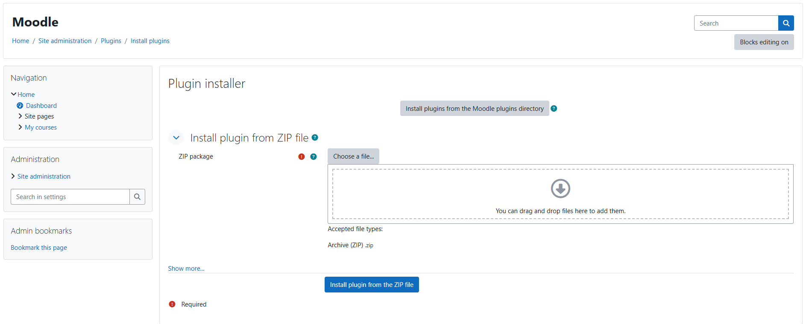
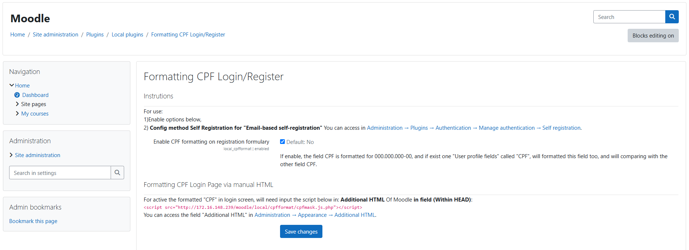

# CPF Format Plugin for Moodle

**Developer:** Lyelfiz - Luiz Henrique Carvalho Vacilio

> **IMPORTANT NOTE:** This plugin is under development. Use at your own risk!

## Description

This Moodle plugin provides CPF (Cadastro de Pessoas Físicas - Brazilian Tax ID) formatting and validation for user account creation and login. When enabled, it formats CPF inputs from `00000000000` to `000.000.000-00` and makes CPF mandatory during account registration.

## Requirements

- **Moodle Version:** 4.4.9 or higher
- **PHP Version:** 7.0 to 8.2
- **Moodle Feature:** "Self Registration" must be enabled with "Email-based self-registration" active.

## Installation

1. Download the plugin as a ZIP file from the [releases page](https://github.com/Lyelfiz/cpfformat/releases).
2. Go to **Site Administration > Plugins > Install plugins**.
3. Upload the ZIP file and follow the installation prompts.

## Enabling the Plugin

After installation, enable the plugin:

1. Navigate to **Site Administration > Plugins > Local plugins**.
2. Find "CPF Format" and click "Enable".

## Usage

Once enabled, the plugin will:
- Format CPF inputs in the user registration form.
- Validate CPF during account creation.
- Require CPF as a mandatory field for new accounts.

## Contributing

Contributions are welcome! Please:
- Report issues on [GitHub Issues](https://github.com/Lyelfiz/cpfformat/issues).
- Submit pull requests for improvements.

## License

This plugin is licensed under the GPL v3 License. See the LICENSE file for details.