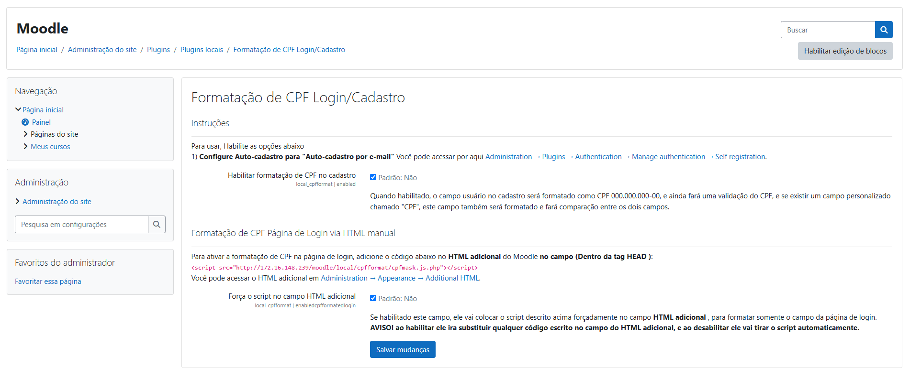

# cpfformat
local_cpfformat is plugin of moodle - Dev: Lyelfiz - LHCV
=======================================

IMPORTANT NOTE: This plugin is under development. Use at your own risk!

=========
For install this plugin, you need download this plugin in .zip and put in <strong>"Administration -> Plugins -> Install plugins"</strong> after that put plugin.zip in Install plugin from ZIP file, example below in the image.

=========
After install, you need enable de plugin, for that you can enable following the instruction in image below

